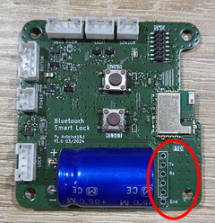
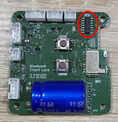

# Bluetooth LE Smart Lock - Firmware

Ce fichier README fournit des instructions pour compiler, flasher et programmer le firmware de la serrure Bluetooth LE à utiliser avec le module BleuNRG.

---

# Compilation

1. Clonez le projet et ses sous-modules : 
   ```
   git clone --recurse-submodules https://github.com:antoine163/ble-smart-lock.git
   ```
2. Installez la chaîne de compilation croisée *arm-none-eabi-gcc*.
3. Installez l'outil *cmake*.
4. Téléchargez le SDK [STSW-BLUENRG1-DK](https://www.st.com/en/embedded-software/stsw-bluenrg1-dk.html). L'inscription sur ST est nécessaire.
5. Extraites avec *innoextract* le contenu du dossier *library* vers `src/board/device/bluenrg-2`. Par exemple, si vous avez téléchargé *STSW-BLUENRG1-DK* près du fichier README.md :
   ```
   mkdir src/device/bluenrg-2
   innoextract BlueNRG-1_2\ DK-3.2.3.0-Setup.exe -I app/Library
   mv app/Library/* src/device/bluenrg-2/
   rm -r app
   ```
6. Vous pouvez spécifier le répertoire de la chaîne d'outils avec la variable d'environnement *ARMGCC_DIR* si le compilateur croisé n'est pas trouvé.
7. Compilez en fonction du modèle BlueNRG. Le modèle doit être passé à cmake via la variable *MODEL_BLUENRG*, avec comme valeur soit *M2SA* ou *M2SP*. Par exemple, pour compiler avec le BLUENRG-M2SA :
   ```
   export ARMGCC_DIR="/to/directory/of/arm-gcc"
   mkdir build
   cd build
   cmake --toolchain cmake/arm-none-eabi-gcc.cmake -DMODEL_BLUENRG=M2SA -DCMAKE_BUILD_TYPE=Release ..
   make
   ```

---

# Flashage

## Via UART

Vous aurez besoin de connecter un ftdi ou tout autre liaison série 3V3 au connecteur repéré FTDI sur le PCB. La liaison série est également disponible via le connecteur STDC14, repéré SWD sur le PCB.

|             FTDI/UART              |             SWD/UART             |
| :--------------------------------: | :------------------------------: |
|  |  |

1. Téléchargez [RF-Flasher utility](https://www.st.com/en/embedded-software/stsw-bnrgflasher.html). L'inscription sur ST est nécessaire.
2. Installez et lancez RF-Flasher utility.
3. Mettez le module en mode bootload en maintenant enfoncé le bouton *bond* et en effectuant un reset en appuyant sur le bouton *reset*. Vous pouvez désormais relâcher le bouton *bond*.
4. Dans RF-Flasher utility, sélectionnez le port COM.
5. Puis dans l’onglet *Image File*, sélectionnez le fichier ble_smart_lock.hex que vous trouverez dans le dossier de build ou le dossier `release`.
6. Cliquez sur le bouton *Flash* et attendez que l'opération se termine avec succès.
7. Redémarrez le module en appuyant sur le bouton *reset*.

## Via SWD

Vous devrez connecter une sonde stlink-v2 au connecteur STDC14 repéré SWD sur le PCB.


### Via openocd

Avant tout, vous devrez installer openocd. Après avoir suivi les étapes de compilation avec cmake, dans le dossier de build, appelez la commande :
```
make flash
```

Si tout s'est bien passé, vous devriez voir apparaître dans le terminal :
```
** Programming Started **
** Programming Finished **
** Verify Started **
** Verified OK **
** Resetting Target **
```

**Note** : Si ce n'est pas la première programmation, le module pourrait se mettre en veille, rendant la connexion avec OpenOCD difficile. Assurez-vous de faire un reset en appuyant sur le bouton reset sur le PCB. Le module n'entre pas en veille durant les 3 premières secondes.

### Via BlueNRG-1 ST-LINK utility

1. Téléchargez [STSW-BNRG1STLINK](https://www.st.com/en/embedded-software/stsw-bnrg1stlink.html). L'inscription sur ST est nécessaire.
2. Installez et lancez ST-LINK utility.
3. Glissez-déposez le fichier ble_smart_lock.hex que vous trouverez dans le dossier de build ou le dossier `release`, dans la vue principale de ST-LINK utility.
4. Démarrez la programmation avec le bouton *Program verify.*
