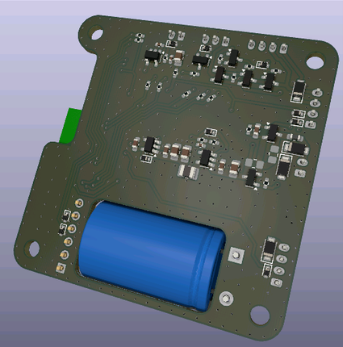
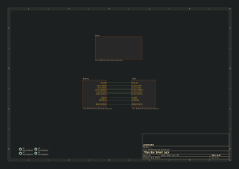
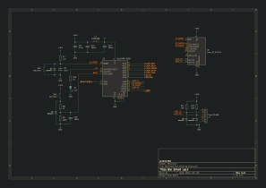

# BleSmartLock Board
Cette carte est la carte principale du projet. Elle est basée sur le module radio Bluenrg-m2 et fais l'interface avec les autres organes, telle que la serrure elle-même et le bouton pour l'ouverture.

## Vue 3D
 
 

## Réalisation
En progression...
 

Vous pouvez trouver [ici](production/Ble_Smart_Lock_1.0-ibom.html) la bom interactive. 

# Schématique

