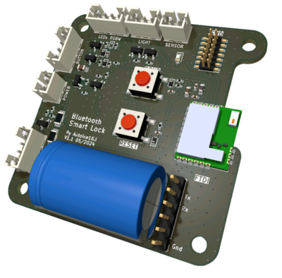
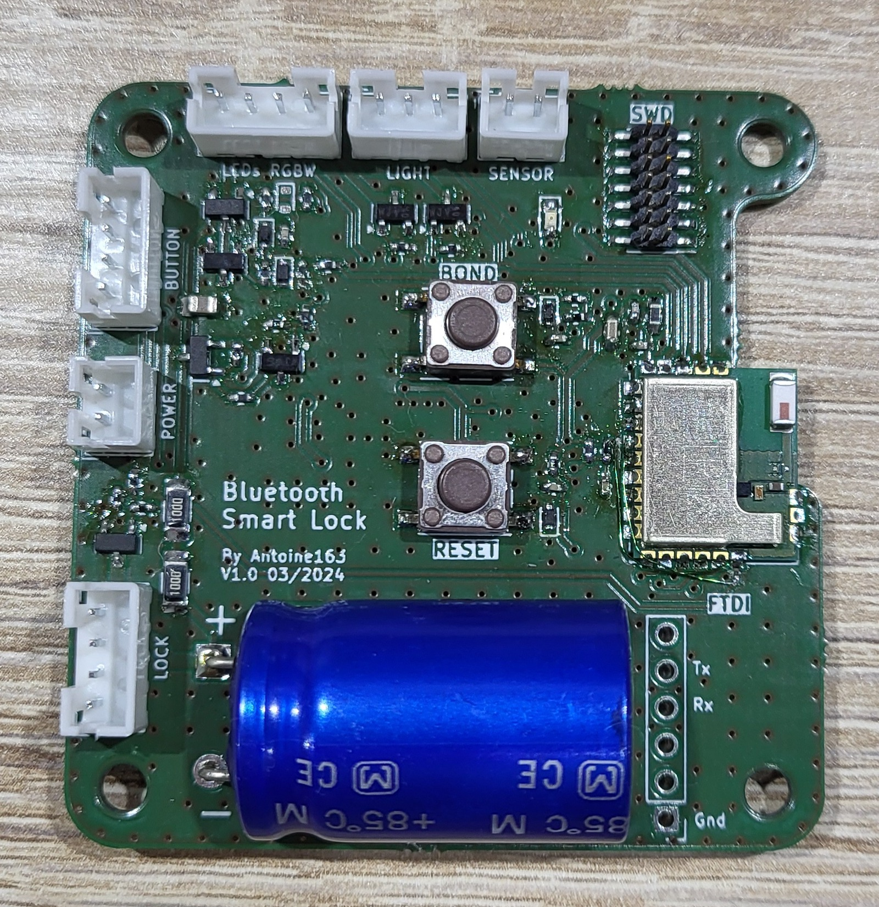
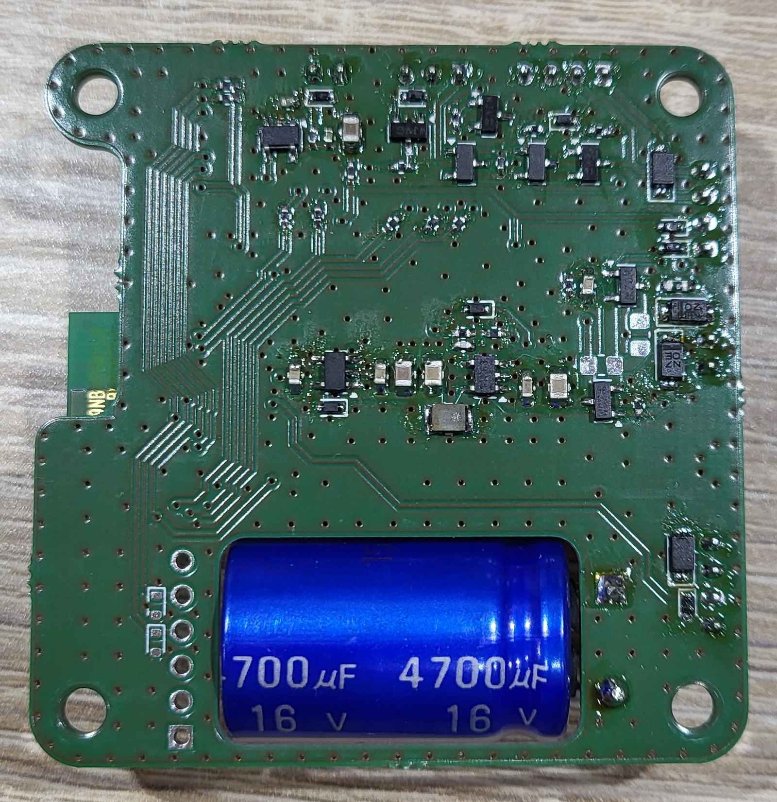
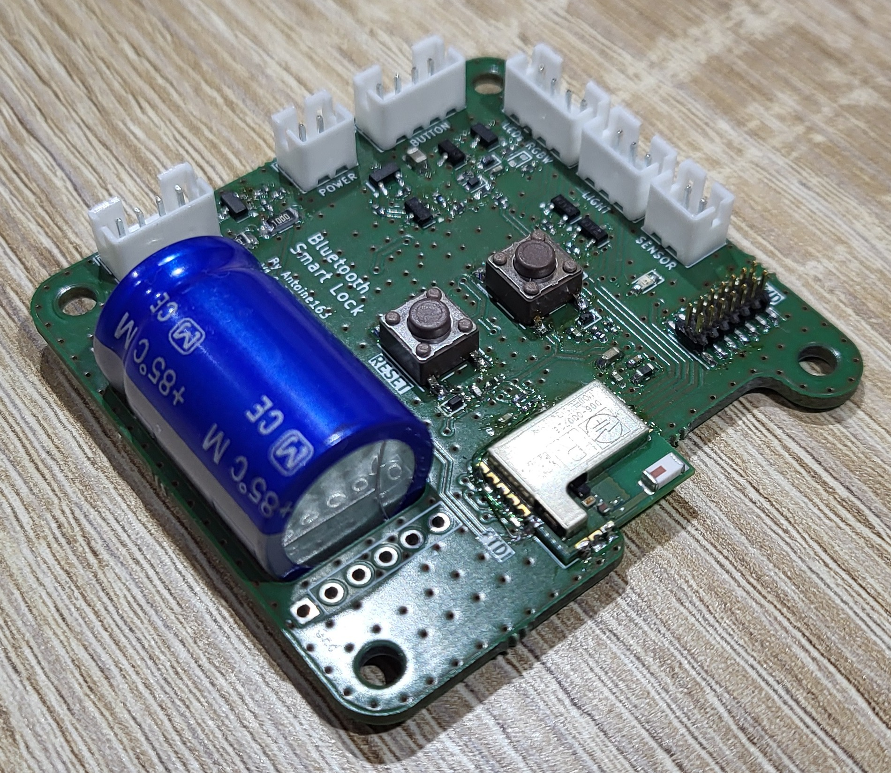
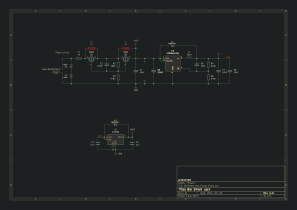
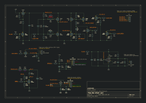

# BleSmartLock Board
Cette carte est la carte principale du projet. Elle est basée sur le module radio Bluenrg-m2 et fais l'interface avec les autres organes, telle que la serrure elle-même et le bouton pour l'ouverture.

Voir le [README](../../Firmware/README.md) du firmware pour la programmation de cette carte.

## Vue 3D
 
 

## Réalisation
### Fabrication de la version v1.0
#### Correction
Une erreur c'est glissée à la saisie de la schématique. DIO12 peut seulement être une entrée. la version v1.1 inverse DIO12 avec DIO6.
Il faut inverser c'est deux gpio sur le pcb en coupent deux pistes et en croisent les connections.

#### Photos

#### BOM
La bom interactive est trouvable [ici](https://antoine163.github.io/ble-smart-lock/Ble_Smart_Lock_1.0-ibom.html). 

### Fabrication de la version v1.1
Je n'est pas fabrique cette version, mais elle dispose exactement des mêmes composent que la v1.0.
La bom interactive est trouvable [ici](https://antoine163.github.io/ble-smart-lock/Ble%20Smart%20Lock-1.1-ibom.html). 

# Schématique

