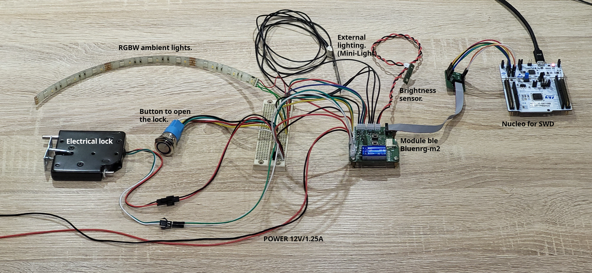

Ce project est constitués de deux cartes :
- **[BleSmartLock](BleSmartLock/README.md)**: Carte principale construite autour du bluenrg-m2, comportent toute l’électronique de contrôle de la serrure.
- **[LightSensor](LightSensor/README.md)**: Carte comportent le capteur de luminosité, permettent de le déporter. Cette carte est optionnelle.

# Vue d’ensemble 
## Réalisation avec les cartes en v1.0

## Prototype sur breadboard

