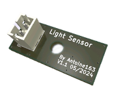
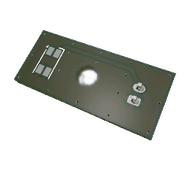
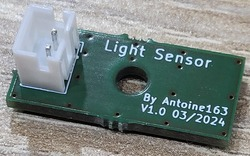
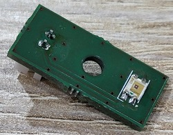
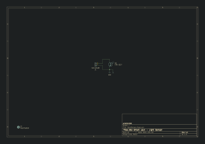

# BleSmartLock-LightSensor Board
C'est la carte satellite permettant de déporter le capteur de luminosité. Elle est constituée principalement du capteur KPS-3227.

## Vue 3D
 
 

## Réalisation
### Fabrication de la version v1.0
#### Photos

#### BOM
Cette carte est constituée seulement d'un connecteur JST et du capteur de lumière ambiante:
- JST: [B2B-PH-K-S](https://www.amazon.fr/gp/product/B0731MZCGF/ref=ppx_yo_dt_b_asin_title_o02_s00?ie=UTF8&psc=1).
- KINGBRIGHT: [KPS-3227SP1C](https://fr.farnell.com/kingbright/kps-3227sp1c/capteur-optique-phototransistor/dp/2373478). 

### Fabrication de la version v1.1
Je n'est pas fabrique cette version, seulement le connecteur à été tournée de 180 degrés.

# Schématique

