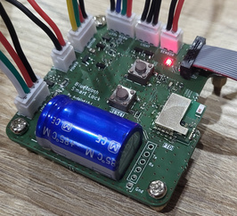

# Bluetooth LE Smart Lock
Ce projet consiste en une serrure électronique pouvant être déverrouillée via Bluetooth Low Energy. 

Il est constitué de 4 parties:
- D'une carte électronique basée sur le module [bluenrg-m2](https://www.st.com/en/wireless-connectivity/bluenrg-m2.html).
- D'un firmware pour le module [bluenrg-m2](https://www.st.com/en/wireless-connectivity/bluenrg-m2.html).
- D'une carte électronique secondaire déportent le capteur de luminosité. (optionnelle).
- D'une application Androïde pour le déverrouillage de la serrure a proximité.

## Fonctions principales
- Déverrouillage via Bluetooth Low Energie.
- Ouverture par bouton poussoir.
- Verrouillage automatique par perte de connection BLE.

## Fonctions secondaire
- Éclairage d'ambience RGBW, pour l'affiche de l’état de la serrure.
- Éclairage extérieur la nuit quand la serrure est ouverte.

### États de la serrure

| BLE           | Porte   | Éclairage ambience  | Éclairage extérieur   | Voyant Bouton |
| ------------- | :-----: | :------:            | :------:              | :----:        |
| Appairage     |         | Vert sinusoïdale    | Éteint                | Éteint        |
| Erreur radio  |         | Rouge fixe          | Éteint                | Éteint        |
||
| Non connecté  | Fermé   | Éteint              | Éteint                | Éteint        |
| Connecté      | Fermé   | Bleu sinusoïdale    | Éteint                | **Allumé** sinusoïdale|
| Déverrouillé  | Fermé   | Bleu fixe           | Éteint                | **Allumé** fixe| 
||                              
| Non connecté (suit déconnexion)               | Ouvert  | Rouge clignotent                    | Éteint                                | Éteint        |  
| Non connecté (suit ouverture par clef)        | Ouvert  | **Blanc** (Nuit) \| Jaune (jour)    | **Allumé** (Nuit) \| Éteint (jour)    | Éteint        |
| Connecté                                      | Ouvert  | **Blanc** (Nuit) \| Jaune (jour)    | **Allumé** (Nuit) \| Éteint (jour)    | Éteint        |
| Déverrouillé                                  | Ouvert  | **Blanc** (Nuit) \| Jaune (jour)    | **Allumé** (Nuit) \| Éteint (jour)    | Éteint        |

## Appairage
Pour passer la serrure en mode appairage, appuyez brièvement sur le bouton bond.  

La lumière d'ambiance devient vert clignotante sinusoïdale et la serrure devient visible par les appareils BLE à proximité.

Le PIN par défaut est 215426. Il peut être changé via la liaison série avec la commande `pin new_pin`, où *new_pin* doit être compris entre 0 et 999999.

### Fermeture du mode appairage
Le mode appairage peut être désactivé de plusieurs façons :
 - En appuyant brièvement sur le bouton *bond*.
 - Automatiquement après un délai de 10 secondes.
 - Automatiquement après une tentative d'appairage réussie ou échouée.

### Effacement de la liste des appareils appairés
Pour effacer la liste des appareils appairés, maintenez le bouton *bond* enfoncé pendant plus de 3 secondes. Deux flashs blancs seront émis une fois la liste effacé.

Il est possible de supprimer cette liste avec la commande `bond-clear` via la liaison série.

## Liste des commande série
- `help`: Afficher l'aide.
- `verbose` : Lecture/écriture du mode verbeux. 1 pour activer, 0 (par défaut) - `pour désactiver.
- `pin` : Lecture/écriture du code PIN (215426 par défaut).
- `bri` : Lecture de la luminosité ambiante.
- `bri-th` : Lecture/écriture du seuil jour/nuit (50% par défaut).
- `bond` : Afficher la liste des appareils appairés.
- `bond-clear` : Supprimer tous les appareils appairés (ou maintenir le bouton - `bond enfoncé pendant plus de 3 secondes).
- `reset` : Réinitialiser toutes les valeurs par défaut.

## Led rouge
La LED rouge située sur le PCB s'allume en fonction de l'activité radio.  

# Fonctionnalités

## Firmware de la serrure
- Connection radio via Bluetooth LE.
- Contrôle de l'ouverture de la serrure.
- Bouton poussoir lumineux extérieure pour ouverture de la serrure et affichage de la possibilité d'ouverture.
- Detection de la luminosité ambient.
- Pilotage de ruban led RGBW 12V, pour affiche de l'état de la serrure.
- Pilotage d'un éclairage 12V ([Mini-Light](https://github.com/antoine163/Mini-Light/tree/master/Elec/light))

## Application Android
- Scan et appairage avec la serrure BLE.
- Renommage du la serrure BLE.
- Déverrouillage et réglage de la proximité BLE.
- Ouverture par bouton de la serrure BLE.
- Notification lors de l'éloignement avec la serrure no verrouiller."

