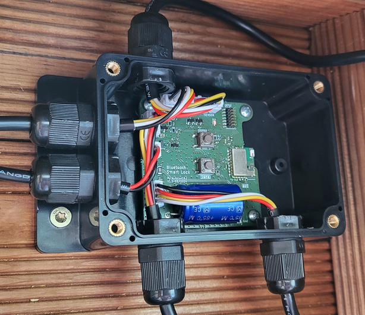

# Bluetooth LE Smart Lock - Hardware

## Cartes électronique
Ce dépôt contient deux cartes :
- **[BleSmartLock](BleSmartLock/README.md)**: La carte principale, construite autour du bluenrg-m2, inclut toute l'électronique de contrôle pour la serrure.
- **[LightSensor](LightSensor/README.md)**: Cette carte contient le capteur de lumière, permettant de le placer à distance. Cette carte est optionnelle.

## Réalisation

### Liste du matérielle:
Cette liste de matériel est disponible sur Amazon.
- [Alimentation 12V](https://www.amazon.fr/dp/B0924XBMCF?ref=ppx_yo2ov_dt_b_fed_asin_title&th=1) pour alimenter la serrure.
- [Serrure électromécanique](https://www.amazon.fr/dp/B07KWMH16C?ref=ppx_yo2ov_dt_b_fed_asin_title) pour la partie électromécanique de la serrure.
- [Bouton lumineux](https://www.amazon.fr/dp/B0CBRFQLLT?ref=ppx_yo2ov_dt_b_fed_asin_title&th=1) pour l'ouverture de la serrure et visualisation de l'état de la serrure.
- [Boîtier étanche](https://www.amazon.fr/dp/B09V7M8759?ref=ppx_yo2ov_dt_b_fed_asin_title) pour recevoir la carte électronique principale *BleSmartLock*.
- [Câble 4 conducteurs](https://www.amazon.fr/dp/B0BFWJ19YJ?ref=ppx_yo2ov_dt_b_fed_asin_title&th=1) pour la connexion entre la carte électronique principale et:
    - La serrure électromécanique
    - Le bouton lumineux
    - L'éclairage d'ambiance
    - Le capteur de lumière
    - L'éclairage extérieur
- [Câble 2 conducteurs](https://www.amazon.fr/dp/B0B7WV1QCW?ref=ppx_yo2ov_dt_b_fed_asin_title) pour l'alimentation.
- [Presse-étoupes](https://www.amazon.fr/dp/B07V7F5HKQ?ref=ppx_yo2ov_dt_b_fed_asin_title&th=1) pour faire passer les différents câbles dans les boîtiers étanches.
- [Boîtier étanche](https://www.amazon.fr/dp/B0BZCS1PN1?ref=ppx_yo2ov_dt_b_fed_asin_title) pour recevoir le capteur de luminosité *LightSensor* et la lampe extérieur *Mini-Light*.
- [Colle epoxy transparent](https://www.amazon.fr/dp/B07JL8JC3N?ref=ppx_yo2ov_dt_b_fed_asin_title) pour réaliser une vitre dans le boîtier du capteur de luminosité et de la lampe extérieur.

### Mise en boiter de la carte principal *BleSmartLock* 
  

### Mise en boiter de la carte capteur *LightSensor* et lampe extérieur *Mini-Light*
On notera ici que 2 cartes *Mini-Light* ont été utilisées pour augmenter la luminosité de la lampe extérieur.  
**NOTE:** Un maximum de 2 cartes *Mini-Light* peut être utilisé directement à la carte principale *BleSmartLock*.  

Au préalable, il est nécessaire de percer un trou rectangulaire et un trou rond dans le couvercle du boîtier, puis de les remplir de colle époxy transparente. Cela permet de créer des vitres, assurant ainsi le passage de la lumière utile au capteur de luminosité et d'éclairage extérieur.  

## Prototypes
### Avec les cartes v1.0

### Sur plaque d'essai

